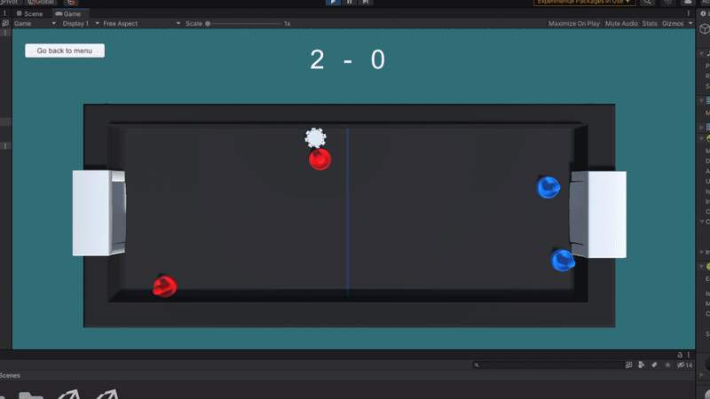

# Air Hockey Multiagent Scenario

In this scenario, multiple agents collaborate for playing a game of air hockey. It involves the use of advanced functionality from the ML-Agents library, such as Self-Play or the MA-POCA trainer.

