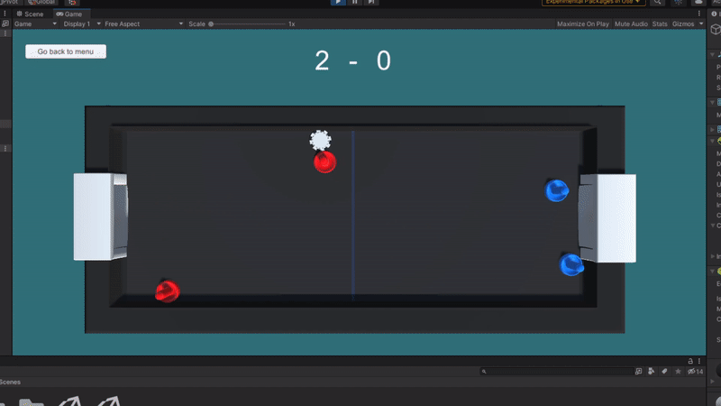

# JAVIVI

This repository includes all the code developed for the final assignment of the 'Intelligent Systems' subject from the University of La Laguna.

Each of the developed scenarios can be played through the binary builds provided in the [Releases](https://github.com/alu0101233598/JAVIVI-SI122/releases) page.

This project was developed in English but documented in Spanish ([report](https://github.com/VirenSDD/JAVIVI-SI122/blob/a0795d85719d41e7488a7f120a2f53c3ec2d7d57/Proyecto%20JAVIVI%20-%20Informe.pdf) and [presentation](https://github.com/VirenSDD/JAVIVI-SI122/blob/a0795d85719d41e7488a7f120a2f53c3ec2d7d57/Proyecto%20JAVIVI%20-%20Presentaci%C3%B3n.pdf)).

## Group components
* Javier Correa Marichal
* Viren Sajju Dhanwani Dhanwani
* Gabriel García Jaubert

## Simple Scenario

## Flappy Bird

## Air Hockey

